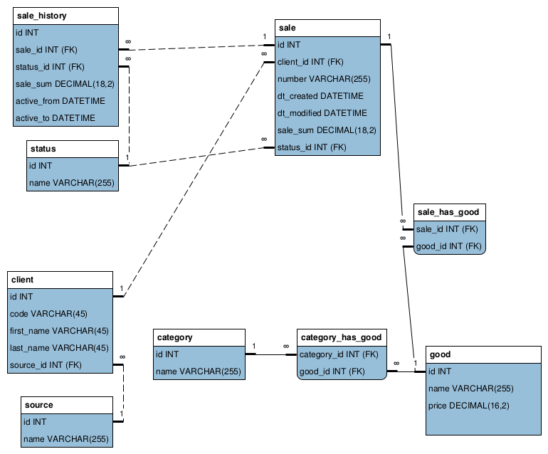

## Исходные данные

База данных магазина `store` следующей структуры:

### Задание

Выведите список всех источников клиентов и суммарный объем заказов по каждому источнику. Результат должен включать также записи для источников, по которым не было заказов.

[Решение](answer3.sql)