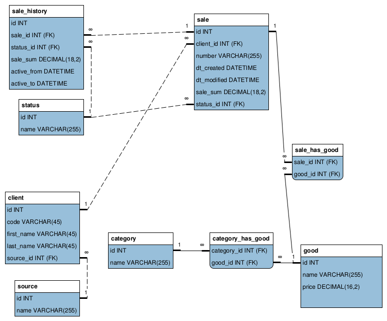

## Исходные данные

База данных магазина `store` следующей структуры:

### Задание

Выведите список всех категорий продуктов и количество продаж товаров, относящихся к данной категории. Под количеством продаж товаров подразумевается суммарное количество единиц товара данной категории, фигурирующих в заказах с любым статусом.

[Решение](answer5.sql)